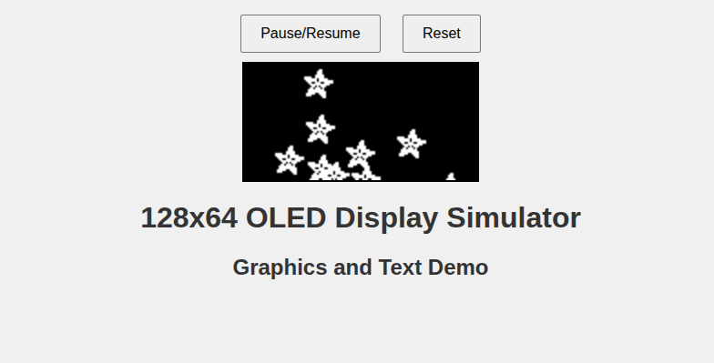

# 1.3" 128x64 OLED Display Sketches: A Growing Library Of Simple Animations (Hopefully)

## Overview

So, I was just trying to get my 128x64 OLED display to do *something*—anything! I followed every tutorial out there, all suggesting “Use `Adafruit_SSD1306.h`!” And it was a total dud, just a blank screen staring back at me making me think that I bought a damaged product. Then, I switched to `Adafruit_SH110X.h`, ran the example code, the display lit up  That’s when I got a bit carried away and started collecting a bunch of animations for this little screen. Here’s the lineup of sketches that turned my OLED into a mini entertainment hub. Feel free to pick any of them you like and use in your own project.

## Simulations

The `visualizations` folder has html files for simulating the exact animation for each arduino sketches. Simply open the html file for the animation you want to check before using it.

## Sketches

 1. **SH1106_128x64_i2c_QTPY.ino**

    - **Description**: This demo shows off the SH1106’s tricks with pixels, lines, circles, triangles, and rectangles, both filled and unfilled. It tosses in some text and a zippy bitmap animation for good measure.
    - **Features**: Adafruit logo graphics, text styling, bitmap zooming, and display inversion.

 2. **oled_random_pattern.ino**

    - **Description**: A mesmerizing swirl of geometric patterns that swap every few seconds.
    - **Features**: Spinning radial lines, pulsing circles, twirling triangles, and wavy sine bands.

 3. **oled_solar_system.ino**

    - **Description**: A simple solar system model.
    - **Features**: Orbital paths, planets with unique speeds and sizes—a mini solar system!

 4. **oled_matrix_rain.ino**

    - **Description**: Digital rain straight from *The Matrix*, with characters cascading down.
    - **Features**: Random letters and numbers.

 5. **oled_ecg.ino**

    - **Description**: A dummy heartbeat monitor.
    - **Features**: Pulsing heart icon, ECG waveform, and a BPM display.

 6. **oled_moisture_dashboard.ino**

    - **Description**: A mock soil moisture dashboard with functions to add real components. Suitable for a simple automatic plant watering system.
    - **Features**: Bar graph, water drop icon, and an ON/OFF watering status.

 7. **oled_fluid.ino**

    - **Description**: Particles in a rotating box, like sand in a box.
    - **Features**: Gravity-driven motion, particle count display for that fluid flair.

 8. **oled_pong.ino**

    - **Description**: Pong on autoplay
    - **Features**: Score tracking, ball speed bars, and sparkly collision particles.

 9. **oled_breakout.ino**

    - **Description**: Breakout game on autoplay.
    - **Features**: Bonus items, particle effects, score/lives, and an auto-restart.

10. **oled_space_invaders.ino**

    - **Description**: Copy of the space invaders game on autoplay.
    - **Features**: Shelters, score/level tracking, and a game-over screen that reboots.

11. **oled_snake.ino**

    - **Description**: Autoplayed snake game.
    - **Features**: Score/length display, flashy food effect, and auto-restart.

12. **oled_eyes_emotions.ino**

    - **Description**: Expressive eyes that blink, sulk, rage, or get dizzy—pure pixel personality.
    - **Features**: Happy, sad, angry, and dizzy animations with quirky movements.

## Setup Instructions

1. **Hardware**: Connect your 128x64 SH1106 OLED display to your Arduino via I2C (SDA, SCL pins).
2. **Libraries**: Install `Adafruit_GFX` and `Adafruit_SH110X` through the Arduino Library Manager.
3. **I2C Address**: Set to `0x3C` (eBay displays) or `0x3D` (Adafruit displays) as needed.
4. **Upload**: Flash these sketches to your Arduino board (QT-PY, XIAO, or similar).
5. **Run**: Run...

## Notes

- All sketches run autonomously—no user interaction implemented (hence, animations).
- Double-check your I2C wiring and library versions to keep things smooth.
